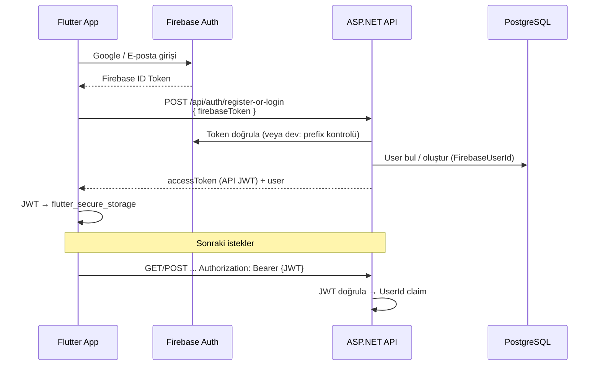

# YouHaveToSay — Uygulama Mimarisi

Türkiye odaklı günlük anket/oylama mobil uygulaması. Kullanıcılar Firebase ile kimlik doğrulaması yapar, backend üzerinden API JWT alır ve henüz oy vermediği aktif anketlere tek seferlik oy kullanır.

---

## Genel Bakış

Proje üç ana parçadan oluşur:

| Bileşen | Teknoloji | Rol |
|---------|-----------|-----|
| **Backend API** | ASP.NET Core 9, EF Core, PostgreSQL | Kimlik doğrulama, anket ve oy iş kuralları |
| **Mobil uygulama** | Flutter 3.11+ | Kullanıcı arayüzü, Firebase/Google girişi |
| **Altyapı** | Docker Compose (PostgreSQL), Firebase | Veri depolama ve kimlik sağlayıcı |

```
┌─────────────────┐     Firebase ID Token      ┌──────────────────┐
│  Flutter Mobile │ ─────────────────────────► │  ASP.NET Core API │
│  (iOS/Android)  │ ◄──── API JWT (Bearer) ─── │  + PostgreSQL     │
└─────────────────┘                            └──────────────────┘
         │                                              │
         └──────── Google Sign-In / Firebase Auth ─────┘
```

---

## Depo (Monorepo) Yapısı

```
YouHaveToSay/
├── src/                          # .NET backend (Clean Architecture)
│   ├── YouHaveToSay.Domain/      # Entity modelleri, ortak tipler
│   ├── YouHaveToSay.Application/ # DTO'lar, arayüzler, iş kuralı sözleşmeleri
│   ├── YouHaveToSay.Infrastructure/ # EF, Firebase, JWT, servis implementasyonları
│   └── YouHaveToSay.Api/         # HTTP API, middleware, DI kökü
├── mobile/                       # Flutter uygulaması
├── tests/                        # xUnit entegrasyon testleri
├── scripts/                      # Geliştirme ve kurulum betikleri
├── docker-compose.yml            # Yerel PostgreSQL
├── YouHaveToSay.sln
├── README.md                     # Kurulum ve hızlı başlangıç
└── ARCHITECTURE.md               # Bu dosya
```

---

## Backend — Katmanlı Mimari

### Katman bağımlılıkları

```
YouHaveToSay.Api
    └── YouHaveToSay.Infrastructure
            └── YouHaveToSay.Application
                    └── YouHaveToSay.Domain
```

- **Domain**: Framework bağımsız entity'ler; dış katmanlara bağımlılık yok.
- **Application**: Use-case arayüzleri (`IAuthService`, `IPollService`), DTO'lar ve özel exception'lar.
- **Infrastructure**: EF Core, Firebase token doğrulama, JWT üretimi, PostgreSQL.
- **Api**: Controller'lar, JWT Bearer yapılandırması, Swagger, global exception middleware.

### Domain — Entity'ler

Tüm entity'ler `AuditableEntity` taban sınıfından türer (`CreatedAt`, `IsActive`).

| Entity | Alanlar | İlişkiler |
|--------|---------|-----------|
| `User` | `Id`, `FirebaseUserId` (unique), `Email` | 1-N `Vote` |
| `Poll` | `Id`, `QuestionTr`, `QuestionEn` | 1-N `PollOption`, 1-N `Vote` |
| `PollOption` | `Id`, `PollId`, `OptionTextTr`, `OptionTextEn` | N-1 `Poll` |
| `Vote` | `Id`, `UserId`, `PollId`, `SelectedOptionId` | N-1 `User`, `Poll`, `PollOption` |

**İş kuralları (veritabanı düzeyinde):**
- `Users.FirebaseUserId` benzersiz.
- `Votes` üzerinde `(UserId, PollId)` unique index → aynı kullanıcı aynı ankete ikinci kez oy veremez.
- `SaveChanges` sırasında yeni kayıtlara otomatik `CreatedAt` ve `IsActive = true` atanır.

### Application — Sözleşmeler ve DTO'lar

**Auth:**
- `RegisterOrLoginRequest` → `{ firebaseToken }`
- `AuthResponse` → `{ accessToken, expiresAt, user }`

**Polls:**
- `PollDto` → soru metinleri (TR/EN) + seçenek listesi
- `VoteRequest` → `{ selectedOptionId }`

**Exception hiyerarşisi** (`AppException` tabanı):
- `UnauthorizedAppException` → 401
- `NotFoundAppException` → 404 (ör. `NO_MORE_POLLS`)
- `ConflictAppException` → 409 (ör. `ALREADY_VOTED`)
- `BadRequestAppException` → 400

### Infrastructure — Önemli servisler

| Servis | Dosya | Görev |
|--------|-------|-------|
| `AuthService` | `Auth/AuthService.cs` | Firebase token doğrula → kullanıcı oluştur/bul → API JWT döndür |
| `PollService` | `Polls/PollService.cs` | Sonraki anketi getir, oy kaydet |
| `JwtTokenService` | `Auth/JwtTokenService.cs` | HMAC-SHA256 imzalı JWT (claim: `NameIdentifier` = User.Id) |
| `FirebaseTokenVerifier` | `Auth/FirebaseTokenVerifier.cs` | Production: Firebase Admin SDK |
| `DevelopmentFirebaseTokenVerifier` | `Auth/DevelopmentFirebaseTokenVerifier.cs` | Dev: `dev:{uid}:{email}` formatı |
| `DevelopmentDataSeeder` | `Persistence/DevelopmentDataSeeder.cs` | Development ortamında örnek 3 anket |

Firebase doğrulayıcı seçimi (`DependencyInjection.cs`):
- `Firebase:UseEmulator = true` → Admin SDK (emulator)
- `Firebase:Enabled = true` + geçerli `CredentialsPath` → Admin SDK
- Aksi halde → `DevelopmentFirebaseTokenVerifier`

### API — Uç noktalar

| Metot | Yol | Auth | Açıklama |
|-------|-----|------|----------|
| POST | `/api/auth/register-or-login` | Hayır | Firebase token alır, kullanıcıyı upsert eder, API JWT döner |
| GET | `/api/polls/next` | Bearer JWT | Kullanıcının oy vermediği bir sonraki aktif anket |
| POST | `/api/polls/{id}/vote` | Bearer JWT | Seçilen seçenekle oy kaydı (204) |
| GET | `/health` | Hayır | Sağlık kontrolü |

**Poll seçim mantığı:** Aktif anketler arasından kullanıcının daha önce oy verdiği `PollId`'ler çıkarılır; kalanlardan `CreatedAt` azalan sırada ilki döner. Anket yoksa `404` + `{ "code": "NO_MORE_POLLS" }`.

**Middleware sırası:** `ExceptionHandlingMiddleware` → (Development) Swagger → Authentication → Authorization → Controllers.

**Mevcut kullanıcı:** `CurrentUserService`, JWT içindeki `ClaimTypes.NameIdentifier` claim'inden `UserId` okur.

### Yapılandırma

`appsettings.json` / `appsettings.Development.json`:

```json
{
  "ConnectionStrings": { "DefaultConnection": "Host=localhost;Port=5432;..." },
  "Firebase": {
    "Enabled": true,
    "UseEmulator": false,
    "ProjectId": "...",
    "CredentialsPath": "firebase-credentials.json"
  },
  "Jwt": {
    "Secret": "en-az-32-karakter",
    "Issuer": "YouHaveToSay",
    "Audience": "YouHaveToSay",
    "ExpirationMinutes": 10080
  }
}
```

API varsayılan adresi: **http://localhost:5106** (`launchSettings.json`).

---

## Kimlik Doğrulama Akışı



### Geliştirme modu token'ı

Firebase kapalıyken (`Firebase:Enabled: false`) veya mobilde `USE_DEV_AUTH=true` iken:

```
dev:{firebaseUserId}:{email}
```

Örnek: `dev:abc123:user@test.com`

Mobil `FirebaseTokenProvider`, dev modda e-postanın hash'inden `uid` üretir.

---

## Veritabanı

- **Motor:** PostgreSQL 16 (Docker: `docker compose up -d`)
- **ORM:** Entity Framework Core + Npgsql
- **Migration:** `src/YouHaveToSay.Infrastructure/Persistence/Migrations/`

EF konfigürasyonları `Persistence/Configurations/` altında (unique index'ler, ilişkiler).

---

## Mobil Uygulama (Flutter)

### Dizin yapısı

```
mobile/lib/
├── main.dart                 # Firebase init, EasyLocalization, DI
├── app.dart                  # MaterialApp, BlocProvider, root router
├── firebase_options.dart     # flutterfire configure çıktısı
├── core/
│   ├── config/               # AppConfig, Firebase hazırlık kontrolü
│   ├── di/injection.dart     # get_it kayıtları
│   ├── network/              # Dio client, token storage, Firebase token
│   └── theme/app_theme.dart
└── features/
    ├── auth/
    │   ├── data/             # AuthRepositoryImpl, GoogleAuthService
    │   ├── domain/           # AuthRepository arayüzü, AuthSession
    │   └── presentation/     # AuthBloc, AuthScreen
    └── polls/
        ├── data/             # PollsRepositoryImpl, PollDto
        ├── domain/           # Poll modeli, PollsRepository
        └── presentation/     # PollBloc, PollScreen, PollCard, animasyonlar

mobile/assets/translations/
├── tr.json
└── en.json
```

### Mimari desen

Feature-first **Clean Architecture** + **BLoC** state management:

- **Presentation:** `AuthBloc`, `PollBloc`, ekranlar ve widget'lar
- **Domain:** Repository arayüzleri, domain modelleri
- **Data:** Repository implementasyonları, API DTO mapping

### Bağımlılık enjeksiyonu (`get_it`)

Kayıtlar: `AppConfig`, `FlutterSecureStorage`, `AuthTokenStorage`, `FirebaseTokenProvider`, `Dio`, `AuthRepository`, `PollsRepository`, `AuthBloc`, `PollBloc`.

### Ağ katmanı (`api_client.dart`)

- **Auth exchange** (`/api/auth/register-or-login`): İstek gövdesinde `firebaseToken`; isteğe bağlı `X-Firebase-Token` header.
- **Diğer istekler:** `Authorization: Bearer {apiJwt}` (`AuthTokenStorage`'dan).

### Uygulama akışı (`app.dart`)

```
AuthBloc durumu:
  unknown        → yükleme göstergesi
  unauthenticated → AuthScreen (giriş)
  authenticated   → PollScreen (anketler)
```

`AuthStarted` her açılışta `signOut()` çağırır → otomatik oturum açma yok; kullanıcı her seferinde giriş yapar.

### Poll ekranı akışı

1. `PollLoadNextRequested` → `GET /api/polls/next`
2. Kullanıcı seçenek seçer → `PollVoteSubmitted`
3. `POST /api/polls/{id}/vote` → başarı animasyonu (~700 ms)
4. Otomatik olarak sonraki anket yüklenir (`slideKey` ile `AnimatedSwitcher` geçişi)
5. Anket kalmadıysa `NoMorePollsException` → “Oylayacak başka anket kalmadı”

### Yapılandırma (`AppConfig`)

| Dart define | Varsayılan | Açıklama |
|-------------|------------|----------|
| `API_BASE_URL` | iOS: `localhost:5106`, Android: `10.0.2.2:5106` | Backend adresi |
| `USE_DEV_AUTH` | `false` | `true` → Firebase olmadan dev token |
| `FIREBASE_WEB_CLIENT_ID` | — | Google Sign-In web client ID |

Firebase hazır mı: `firebase_options.dart` içindeki `apiKey` boş veya `REPLACE` değilse `isFirebaseReady = true`.

### Kullanılan paketler

`flutter_bloc`, `dio`, `get_it`, `firebase_core`, `firebase_auth`, `google_sign_in`, `flutter_secure_storage`, `easy_localization`, `flutter_screenutil`, `equatable`.

---

## Betikler (`scripts/`)

| Betik | Amaç |
|-------|------|
| `start-dev-stack.sh` | PostgreSQL + Firebase Auth Emulator + API |
| `start-firebase-emulator.sh` | Sadece Firebase Auth emulator |
| `setup-google-signin.sh` / `setup-google-signin-auto.sh` | Google giriş kurulumu |
| `setup-firebase-mobile.sh` | Mobil Firebase yapılandırması |
| `refresh-google-config.sh` | Google OAuth yapılandırmasını yenile |
| `setup-turkish-keyboard-ios.sh` | iOS simülatör Türkçe klavye |
| `setup-turkish-keyboard-android.sh` | Android emülatör Türkçe klavye |

---

## Testler

```
tests/
├── YouHaveToSay.Infrastructure.Tests/   # Veritabanı şeması, audit alanları, unique kısıtlar
└── YouHaveToSay.Api.Tests/              # WebApplicationFactory ile API entegrasyon testleri
```

Çalıştırma:

```bash
docker compose up -d
dotnet test
```

Doğrulanan kurallar: audit alanları, `FirebaseUserId` benzersizliği, tekrar oy engeli, poll API uç noktaları.

Mobil tarafında `mobile/test/` altında `poll_bloc_test`, `poll_model_test`, `widget_test`.

---

## Geliştirme Ortamını Başlatma

**Tam yığın (önerilen):**

```bash
./scripts/start-dev-stack.sh   # PostgreSQL + Firebase emulator + API
cd mobile && flutter run
```

**Manuel:**

```bash
docker compose up -d
dotnet ef database update --project src/YouHaveToSay.Infrastructure --startup-project src/YouHaveToSay.Api
dotnet run --project src/YouHaveToSay.Api
cd mobile && flutter pub get && flutter run
```

Swagger (Development): http://localhost:5106/swagger

---

## Güvenlik Notları

- `firebase-credentials.json` ve JWT secret production'da ortam değişkeni veya gizli yapılandırma ile verilmeli; repoya commit edilmemeli.
- API JWT süresi varsayılan 10080 dakika (7 gün); `Jwt:ExpirationMinutes` ile ayarlanır.
- Oy tekrarı hem uygulama katmanında (`PollService`) hem veritabanı unique index ile korunur.

---

## Özet: Veri ve Kontrol Akışı

1. Kullanıcı mobilde Firebase/Google veya dev e-posta ile giriş yapar.
2. Firebase ID token backend'e gönderilir; SQL'de `User` kaydı oluşur veya bulunur.
3. Backend özel JWT döner; mobil güvenli depoda saklar.
4. Anket ekranı JWT ile korumalı endpoint'leri çağırır.
5. Her anket için tek oy; oy sonrası sıradaki anket gösterilir.
6. Tüm anketler tüketildiğinde API `NO_MORE_POLLS` döner.

Bu doküman, depodaki mevcut kod tabanının anlık mimarisini yansıtır. Kurulum adımları için [README.md](README.md) ve mobil detaylar için [mobile/README.md](mobile/README.md) dosyalarına bakın.
